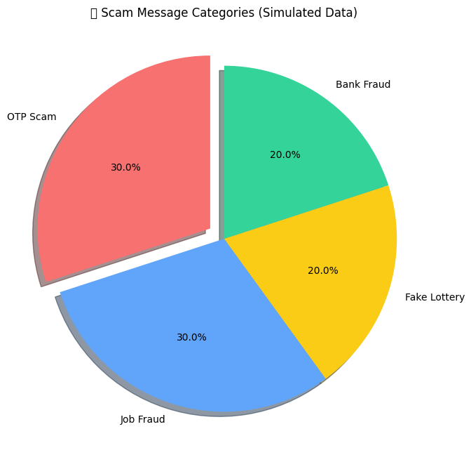

# Scam Message Visualization 📊

This project shows a pie chart of different scam categories such as OTP scams, Job frauds, Fake lottery schemes, and Bank frauds.

### Features:
- Visual representation of scam categories using a pie chart.
- Made with **Pandas** and **Matplotlib**.

### Installation & Usage:
1. Clone the repository:
    ```bash
    git clone https://github.com/swasthiik/scam-insights-visualization.git
    ```
2. Navigate to the project folder and run:
    ```bash
    python scam_chart.py
    ```
3. The pie chart will be displayed with the scam categories.

### View the project on GitHub: [scam-insights-visualization](https://github.com/swasthiik/scam-insights-visualization)

---

### Screenshots:



